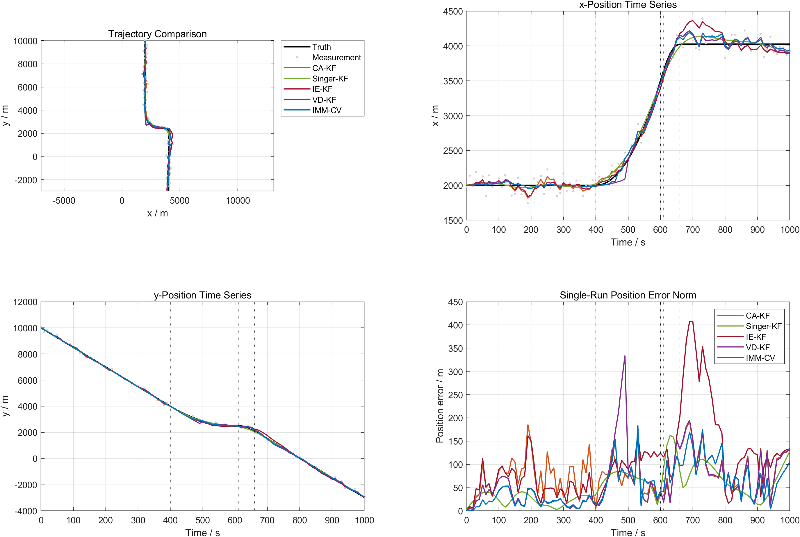
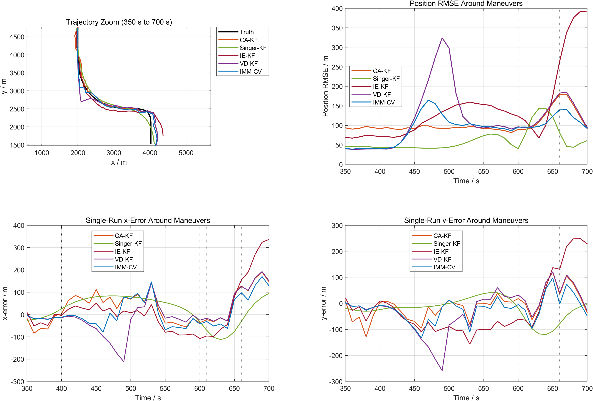
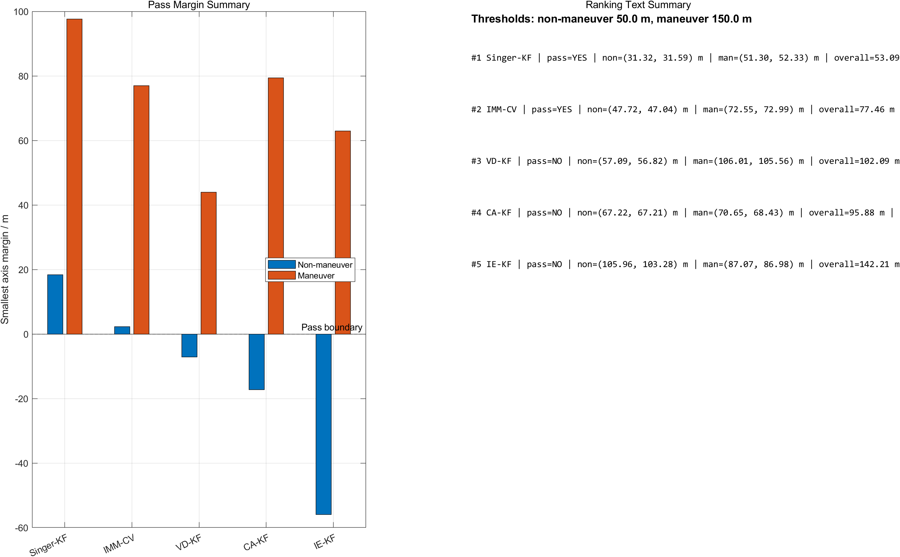

# Maneuvering Target Tracking Benchmark

Public MATLAB benchmark for maneuvering target tracking under noisy 2D position
measurements. The project compares five classical tracking strategies with one
shared scenario, one shared evaluation rule, and one shared visualization
pipeline.


## What This Repository Shows

- a piecewise maneuvering target trajectory with straight and turning segments
- noisy position-only measurements
- five tracking algorithms evaluated under the same conditions
- segment-wise threshold checking, overall RMSE comparison, and runtime analysis
- report-ready figures and animation export for presentation use

## Visual Snapshot

<p align="center">
  
  
</p>

<p align="center">
  
</p>

## Compared Algorithms

| Algorithm | Core idea | Typical role in this repo |
| --- | --- | --- |
| `CA-KF` | Single constant-acceleration Kalman filter | Baseline single-model tracker |
| `Singer-KF` | Correlated-acceleration model with smoothing | Strong offline benchmark |
| `IE-KF` | Estimate maneuver input from innovation behavior | Maneuver reconstruction attempt |
| `VD-KF` | Switch state dimension between simpler and richer kinematics | Adaptive model-complexity tracker |
| `IMM-CV` | Fuse multiple motion models with probability weighting | Strong real-time benchmark |

## Latest Benchmark Snapshot

Current public preview figures correspond to the latest local benchmark run with
`200` Monte Carlo trials, `10 s` sampling interval, and threshold limits of
`50 m` on non-maneuver segments and `150 m` on maneuver segments.

| Rank | Algorithm | Pass all thresholds | Non-maneuver x/y (m) | Maneuver x/y (m) | Overall position RMSE (m) | Runtime (s) |
| --- | --- | --- | --- | --- | ---: | ---: |
| 1 | `Singer-KF` | YES | 31.32 / 31.59 | 51.30 / 52.33 | 53.09 | 1.1125 |
| 2 | `IMM-CV` | YES | 47.72 / 47.04 | 72.55 / 72.99 | 77.46 | 2.0019 |
| 3 | `VD-KF` | NO | 57.09 / 56.82 | 106.01 / 105.56 | 102.09 | 0.9738 |
| 4 | `CA-KF` | NO | 67.22 / 67.21 | 70.65 / 68.43 | 95.88 | 0.3524 |
| 5 | `IE-KF` | NO | 105.96 / 103.28 | 87.07 / 86.98 | 142.21 | 1.1884 |

Notes:

- `Singer-KF` is the best offline result here because the rebuilt version uses
  Rauch-Tung-Striebel smoothing.
- `IMM-CV` is the strongest real-time method among the compared filters.

## Quick Start

### Run the legacy experiment

From the project root:

```matlab
clear functions
results = run_tracking_experiment;
```

### Run the rebuilt benchmark from the project root

```matlab
clear functions
results = run_tracking_benchmark_from_root;
```

### Run the rebuilt benchmark from its own folder

From `tracking_benchmark_v2/`:

```matlab
clear functions
results = run_tracking_benchmark;
```

## Repository Layout

```text
project_root/
|-- README.md
|-- .gitignore
|-- run_tracking_experiment.m
|-- run_tracking_benchmark_from_root.m
|-- legacy_tracking_project/
|-- tracking_benchmark_v2/
`-- docs/
    |-- assets/
    |-- 01_presentation/
    |-- 02_report_materials/
    |-- 03_specifications/
    `-- 04_references/
```

- `legacy_tracking_project/`: original experiment structure kept for
  compatibility and historical reference
- `tracking_benchmark_v2/`: rebuilt comparison framework with unified
  evaluation, tuning, plotting, and animation export
- `docs/assets/`: selected public preview figures used by this README
- `private_local/`: ignored local-only materials such as private slides,
  coursework drafts, reference PDFs, and generated outputs

## Public vs Local-Only Content

The public repository keeps runnable MATLAB source code, lightweight
documentation, and selected preview figures. Private presentation files,
coursework drafts, downloaded papers, and bulk generated outputs stay under
`private_local/`, which is ignored by Git.

See `docs/README.md` for the documentation structure.

## Open-Source Support Files

- `LICENSE`: MIT license for public reuse
- `CONTRIBUTING.md`: contribution and verification guide
- `CODE_OF_CONDUCT.md`: collaboration expectations
- `CITATION.md`: suggested repository citation
- `.github/`: issue and pull request templates for cleaner collaboration
